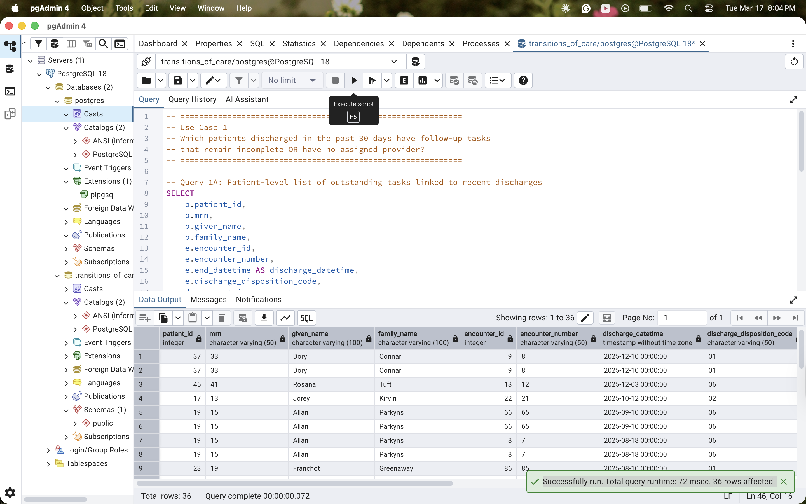
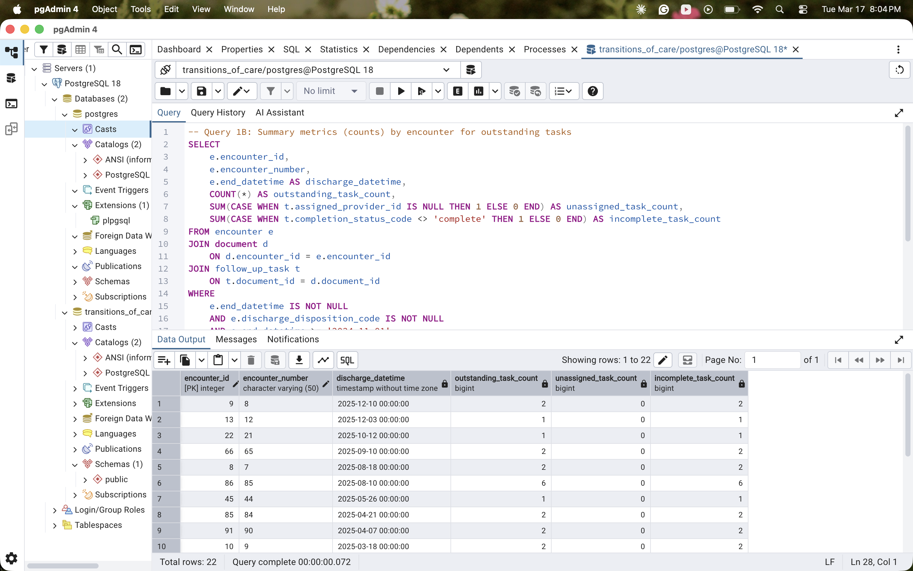
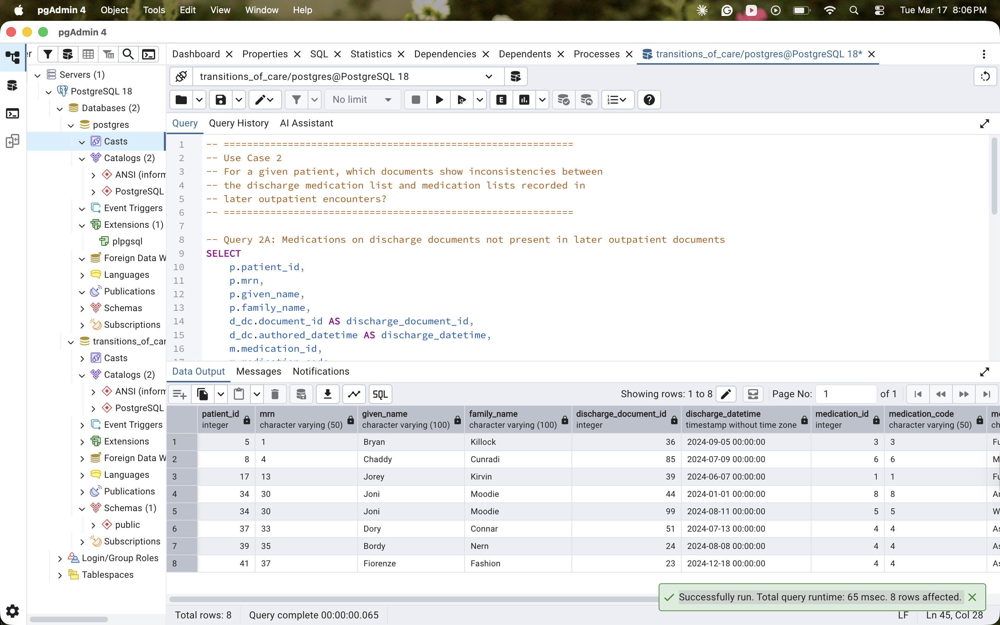
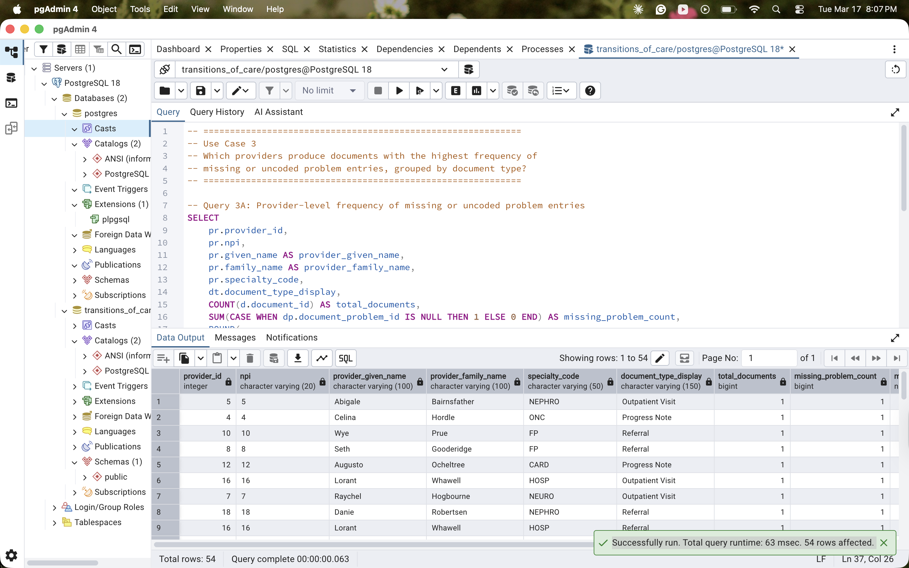

# Transitions of Care Relational Analytics

*All data in this project is synthetic and contains no real patient information.*

## Overview
This repository contains a normalized relational database model designed to support workflow and documentation analytics in transitions-of-care processes. The schema enforces referential integrity and composite uniqueness constraints to ensure reliable analytical outputs.

The model was engineered to support time-windowed queries, reconciliation comparisons, and task lifecycle tracking.

## Project Objective
- Design a relational schema capable of answering structured operational questions across patient encounters, authored documentation, and follow-up workflows.
- Validate integrity through constraint enforcement and explicit handling of nullable lifecycle states.

## Core Analytical Use Cases

**1. Identify discharge-related follow-up tasks that remain incomplete or unassigned within 30 days.**

**2. Detect medication discrepancies across documentation contexts (discharge vs. outpatient).**

**3. Analyze frequency distributions of documented problems by encounter type.**

## Data Model Overview
The model follows an event-based documentation design.

### Grain Definitions
- **DOCUMENT** — One row represents one authored clinical document for a single patient during a single encounter.
- **FOLLOW_UP_TASK** — One row represents one discrete follow-up action linked to exactly one document and optionally assigned to a provider.

### Core Entities
- PATIENT
- ENCOUNTER
- DOCUMENT
- FOLLOW_UP_TASK
- PROVIDER
- CARE_TEAM
- CARE_TEAM_MEMBER

### Reference Entities
- DOCUMENT_TYPE
- PROBLEM
- MEDICATION
- ALLERGY

### Junction Tables
- DOCUMENT_PROBLEM
- DOCUMENT_MEDICATION
- DOCUMENT_ALLERGY

## Design Decisions

### Normalization
Tables are structured to third normal form (3NF) to eliminate redundant storage and maintain clean relational integrity.

### Controlled Identifiers
Business identifiers (MRN, NPI, encounter_number, document_identifier, problem_code, medication_code) are enforced with UNIQUE constraints.

### Many-to-Many Relationships
Junction tables enforce composite uniqueness constraints to prevent duplicate document-to-concept associations.

### Lifecycle State Modeling
Nullable fields explicitly represent workflow state:
- `assigned_provider_id` may be NULL (unassigned tasks)
- `end_date` and `completed_datetime` may be NULL for active records

## Data Integrity Controls
- All foreign keys enforced
- Composite uniqueness constraints applied to junction tables
- No orphan records permitted
- Referential consistency maintained across all event relationships

## Repository Structure
- `schema.sql` — Data definition language (DDL)
- `analytical_queries.sql` — Use-case query logic
- `Patient ERD.png` — Entity-relationship diagram
- `data_dictionary.md` — Column-level metadata
